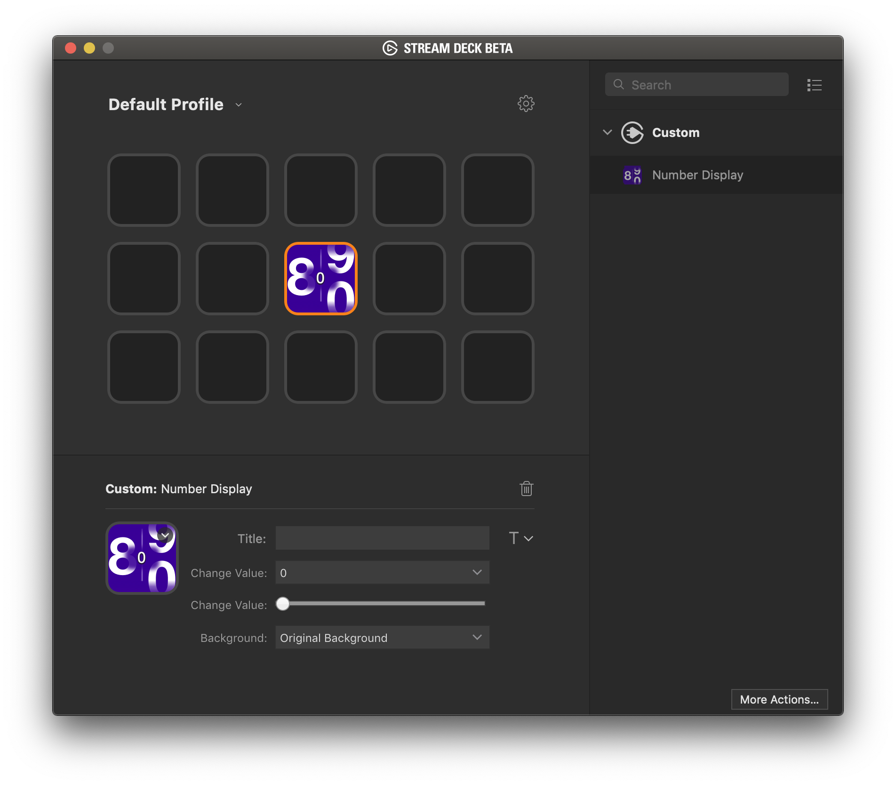

`NumberDisplay` is a sample plugin demonstrating the [Stream Deck SDK](https://developer.elgato.com/documentation/stream-deck/).

# Description

`NumberDisplay` is a plugin that displays a number chosen by the user. This plugin demonstrates how to create a custom Property Inspector and how to pass values from Property Inspector's input controls to the plugin.

# Features

- code written in Javascript
- cross-platform (macOS, Windows)
- Property Inspector with multiple UI elements
- localized

# Installation

In the Release folder, you can find the file `com.elgato.numberdisplay.streamDeckPlugin`. If you double-click this file on your machine, Stream Deck will install the plugin.

# Source code

The Sources folder contains the source code of the plugin.
